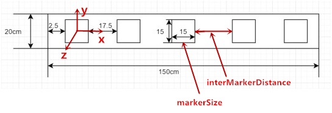

<!--
 * @Descripttion: 
 * @version: 
 * @Author: pifan
 * @Date: 2021-03-09 18:47:07
 * @LastEditors: pifan
 * @LastEditTime: 2021-03-10 10:00:24
-->
# map_builder程序说明

## 配置文件
### 坐标系说明
   每一条二维码都有一个局部坐标系，该坐标系的选取规则为令该条二维码左边数起第一个二维码的中心为该坐标系的原点，并且X轴水平向右，y轴垂直向上，z轴垂直于纸面向外
### 参数意义
1. stringxxx : [tfX, tfY, tfZ, tfYaw, tfP, tfR, markerSize, interMarkerDistance，markersQuantity, ID0, ID1, ID2, ID3, ID4...]
2. stringxxx是为了区分不同片区的二维码，可以任意命名，如命名为markers0,marker1
3. tfX, tfY, tfZ, tfYaw, tfP, tfR分别为x,y,z的偏移量（m），和关于z,y,x的旋转角（rad），markerSize为单个二维码的边长, interMarkerDistance为两个相邻的二维的间距，markersQuantity为该条二维码的数量，ID0, ID1, ID2, ID3, ID4...从左到右二维码的ID号

### TF规则
1. 首先确定一条二维码，其局部坐标系作为全局的二维码坐标系，其中tfX, tfY, tfZ, tfYaw, tfP, tfR所有的值全部为0
2. 其余条二维码以全局坐标系为父坐标系，自身局部坐标为子坐标系，求得tfX, tfY, tfZ, tfYaw, tfP, tfR，将其填入相应的位置。
3. tfX, tfY, tfZ取值过程为：填入子坐标系的坐标原点在父坐标系中的相应的偏移量
4. tfYaw, tfP, tfR的取值过程：绕父坐标系的动轴，旋转顺序为z，y，x，即父坐标系经过怎样的旋转即可得到子坐标系的姿态。
    
### 配置文件示例
参见agv_navigation/config/map_builder/markers_config.yaml，此配置文件为德普二楼布置的二维码的配置文件。